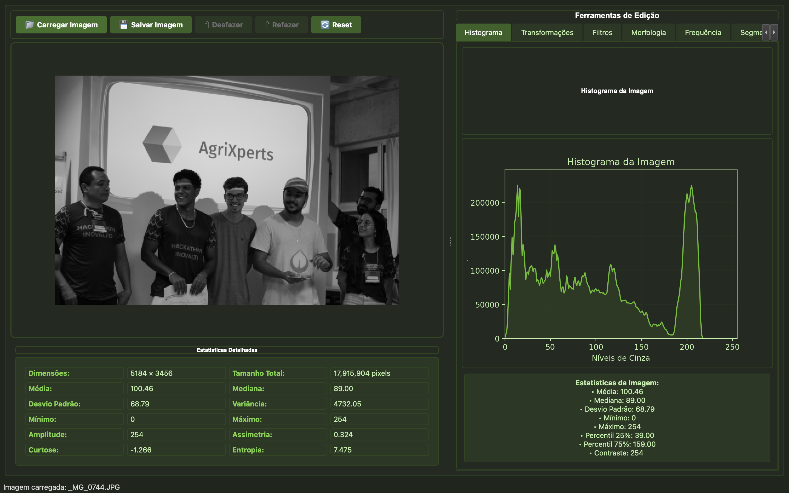
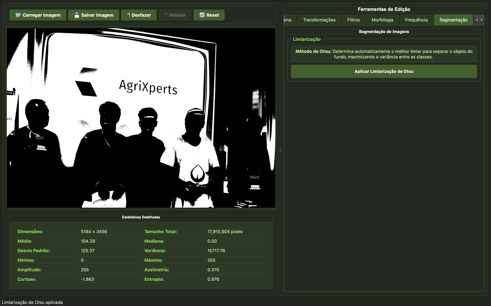

# Sistema de Edição e Análise de Imagens - SIN392

Um sistema interativo em Python com interface gráfica moderna para edição e análise de imagens, desenvolvido para a disciplina SIN392 - Processamento Digital de Imagens (UFV - Junho de 2025).

## Link do Vídeo - Youtube

### Vídeo
- https://youtu.be/IiEnCvyNKXw

## Funcionalidades

### Histograma

- **Cálculo e exibição do histograma** da imagem em tempo real
- **Aba exclusiva com informações estatísticas** detalhadas:
  - Média, mediana, desvio padrão, variância
  - Valores mínimo e máximo
  - Percentis (25% e 75%)
  - Assimetria, curtose e entropia
  - Contraste da imagem

### Transformações de Intensidade

- **Alargamento de contraste** com valores padrão (0-255)
- **Equalização de histograma** automática

### Filtros Passa-Baixa (Suavização)

- **Filtro da média** (kernel 3x3)
- **Filtro da mediana** (kernel 3x3)
- **Filtro gaussiano** (sigma = 1.0)
- **Filtro máximo** e **filtro mínimo** (kernel 3x3)

### Filtros Passa-Alta (Detecção de Bordas)

- **Laplaciano** para detecção de bordas
- **Roberts** para detecção de bordas diagonais
- **Prewitt** para detecção de bordas horizontais e verticais
- **Sobel** para detecção de bordas com suavização

### Convolução no Domínio da Frequência

- **Filtros passa-alta e passa-baixa** no domínio da frequência (frequência de corte = 30)
- **Espectro de Fourier** com visualização interativa:
  - Imagem original
  - Espectro de magnitude
  - Perfis horizontal e vertical do centro

### Morfologia Matemática

- **Erosão** com kernel 3x3
- **Dilatação** com kernel 3x3

### Segmentação

- **Método de Otsu** para limiarização automática

## Interface e Experiência do Usuário

### Design Moderno

- Para estilização foi utilizado CSS
- Interface intuitiva e responsiva
- Organização em abas para melhor usabilidade

### Funcionalidades de Interface

- **Carregamento e salvamento** de imagens em múltiplos formatos
- **Sistema de histórico** com desfazer/refazer (até 20 operações)
- **Botão de reset** para retornar à imagem original
- **Mensagens de notificação** na barra de status para feedback do usuário e logs
- **Empilhamento de filtros** - aplicação sequencial de múltiplos filtros (Conforme informado na aula e conforme outros softwares de edição de imagens)

## Organização do Projeto

```
SistemaEdicaoImagens_SIN392/
├── src/
│   ├── filters/
│   │   ├── __init__.py
│   │   └── spatial_filters.py
│   ├── transforms/
│   │   ├── __init__.py
│   │   └── intensity_transforms.py
│   ├── morphology/
│   │   ├── __init__.py
│   │   └── morphological_ops.py
│   ├── segmentation/
│   │   ├── __init__.py
│   │   └── segmentation_methods.py
│   ├── frequency/
│   │   ├── __init__.py
│   │   └── frequency_filters.py
│   └── ui/
│       ├── __init__.py
│       ├── main_window.py
│       ├── image_viewer.py
│       ├── histogram_widget.py
│       ├── stats_widget.py
│       ├── transforms_tab.py
│       ├── filters_tab.py
│       ├── morphology_tab.py
│       ├── frequency_tab.py
│       └── segmentation_tab.py
├── main.py
├── requirements.txt
└── README.md
```

## Instalação e Execução

### Pré-requisitos

- Python 3.8 ou superior
- pip (gerenciador de pacotes Python)

### Instalação

1. **Clone o repositório:**

   ```bash
   git clone https://github.com/herbertribeiro19/SistemaEdicaoImagens_SIN392.git
   cd SistemaEdicaoImagens_SIN392
   ```

2. **Crie um ambiente virtual (recomendado):**

   ```bash
   python -m venv venv
   source venv/bin/activate  # Linux/Mac
   # ou
   venv\Scripts\activate     # Windows
   ```

3. **Instale as dependências:**
   ```bash
   pip install -r requirements.txt
   ```

### Execução

```bash
python main.py
```

## Tecnologias Utilizadas

### Bibliotecas Principais

- **PyQt6**: Interface gráfica moderna
- **OpenCV**: Processamento de imagens
- **NumPy**: Computação numérica
- **Matplotlib**: Visualização de gráficos e histogramas
- **SciPy**: Filtros e operações científicas
- **scikit-image**: Filtros avançados e processamento

### Versões Específicas

- PyQt6==6.6.1
- opencv-python==4.8.1.78
- numpy==1.24.3
- matplotlib==3.7.2
- scipy==1.11.1
- Pillow==10.0.0
- scikit-image==0.21.0

## Funcionalidades Explicadas

### Histograma

O histograma mostra a distribuição dos níveis de cinza na imagem, permitindo analisar o contraste e a distribuição de intensidades. As estatísticas fornecem informações quantitativas sobre as características da imagem.

### Transformações de Intensidade

- **Alargamento de Contraste**: Expande o intervalo de níveis de cinza para melhorar o contraste
- **Equalização de Histograma**: Redistribui automaticamente os níveis de cinza para maximizar o contraste

### Filtros Espaciais

- **Passa-Baixa**: Suavizam a imagem removendo ruído e detalhes finos
- **Passa-Alta**: Destacam bordas e detalhes finos da imagem

### Filtros de Frequência

Operam no domínio da frequência usando a transformada de Fourier, permitindo filtragem mais precisa de componentes específicos da imagem.

### Operações Morfológicas

- **Erosão**: Reduz objetos brancos e expande objetos negros
- **Dilatação**: Expande objetos brancos e reduz objetos negros

### Segmentação

O método de Otsu determina automaticamente o melhor limiar para separar objetos do fundo, maximizando a variância entre as classes.

## Como Usar

1. **Carregar Imagem**: Clique em "📁 Carregar Imagem" e selecione uma imagem
2. **Analisar**: Visualize o histograma e estatísticas na aba correspondente
3. **Aplicar Filtros**: Navegue pelas abas e clique nos botões para aplicar os filtros desejados
4. **Empilhar Operações**: Aplique múltiplos filtros sequencialmente
5. **Desfazer/Refazer**: Use os botões para navegar no histórico
6. **Verificar Status**: Observe as mensagens na barra de status para confirmar as operações
7. **Salvar**: Salve a imagem processada no formato desejado

### Parâmetros Pré-definidos

- **Filtros espaciais**: Kernel 3x3 para média, mediana, máximo e mínimo
- **Filtro gaussiano**: Sigma = 1.0
- **Filtros de frequência**: Frequência de corte = 30 pixels
- **Operações morfológicas**: Kernel 3x3
- **Alargamento de contraste**: Valores 0-255

## Screenshots

### Imagens do sistema

 

**Sistema de Edição e Análise de Imagens - SIN392**  
_Uma ferramenta completa para processamento digital de imagens com interface moderna e intuitiva._
